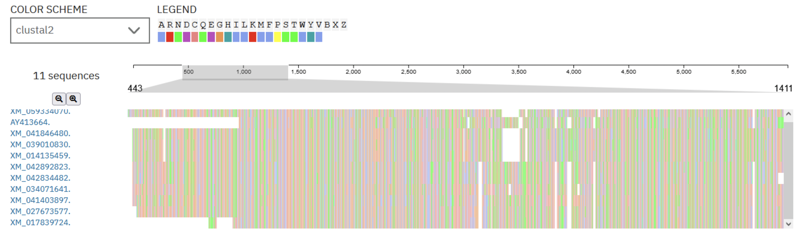

# Изучение представленности генов в таксонах
## Автор
Бузюркин Евгений 22213
## 1. Ген
[VDR](https://www.ncbi.nlm.nih.gov/gene/7421) 

[Последовательность](https://www.ncbi.nlm.nih.gov/nuccore/AY413664.1?report=genbank)

## 2. Параметры BLAST
1. Database - Nucleotide collection (nr/nt)
2. Organism (Exclude) - Mammalia (taxid:40674); Artificial sequences (taxid:81077)
3. Optimize for - Somewhat similar sequences (blastn)
4. Max target sequences - 500

## 3. Таблица генов и видов
| Гомологичный ген | Систематическое название вида | Русское название вида | E-value |
| --- | --- | --- | --- |
| LOC113962807 | Neopelma chrysocephalum | Золотохохлый мухоловковый манакин | 6e-101 |
| LOC121335585 | Onychostruthus taczanowskii | Снежный вьюрок Тачановского | 2e-87 |
| LOC101874550 | Melopsittacus undulatus | Волнистый попугайчик | 7e-81 |
| LOC121538455 | Coregonus clupeaformis | Сельдевидный сиг | 3e-79 |
| LOC131972265 | Centropristis striata | Чёрный морской окунь | 3e-79 |
| LOC108510073 | Lepidothrix coronata | Синеголовая пипра | 6e-101 |
| LOC122192297 | Lagopus leucura | Белохвостая куропатка | 1e-135 |
| LOC122168844 | Centrocercus urophasianus | Шалфейный тетерев | 4e-135 |
| LOC120061205 | Salvelinus namaycush | Озёрный голец-кристивомер | 4e-78 |
| LOC106566896 | Salmo salar | Лосось озёрный | 4e-77 |

## 4. Выравнивание последовательностей
Используя выравниватель [MUSCLE](https://www.ebi.ac.uk/jdispatcher/msa/muscle), я узнал, что в начале почти все последовательности очень сильно совпадают друг с другом, а следовательно консервативные участки расположены именно там. Судя по всему, ген связанный у людей с рецепторами витамина Д был важен в ходе эволюции. 

Помимо этой секции (~1400 нуклеотидов) последовательности имеют относительно мало общего.

## 5. Общий таксон
Euteleostomi (костные позвоночные) - клада, включает в себя рыб и четырёхногих
Если бы в выборке отсутствовали рыбы, то общим таксоном были бы Amniota (амниоты) - клада четырёхногих, характеризующаяся наличием зародышевых оболочек.