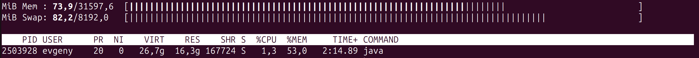
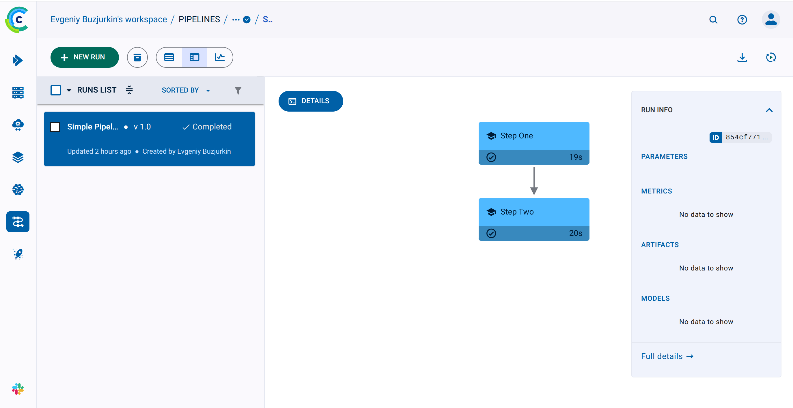
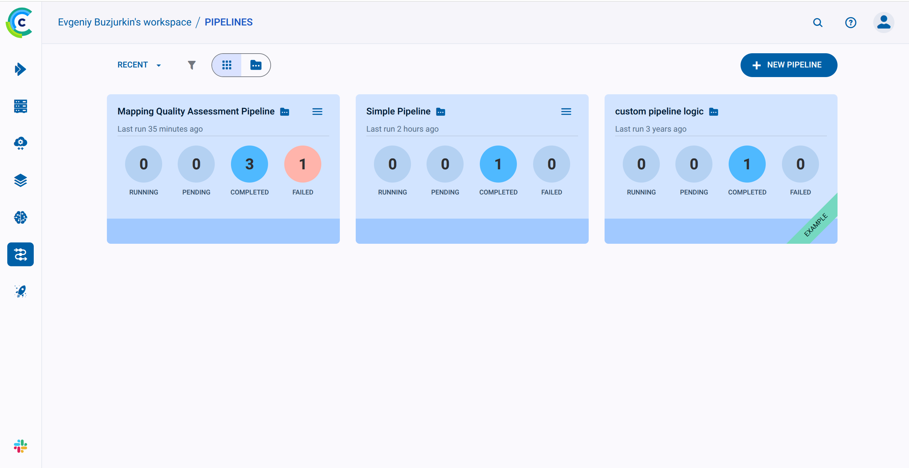
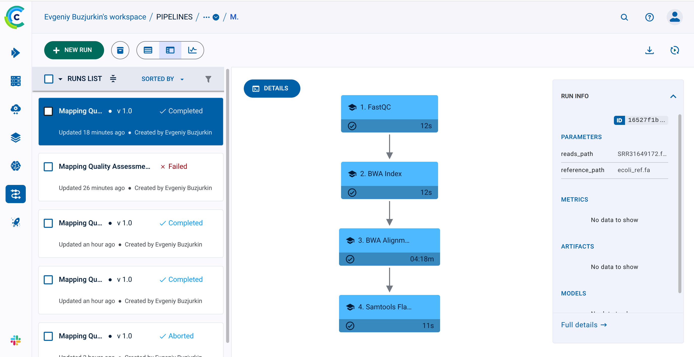

# Домашнее задание 3

## Ссылки на загруженные прочтения из NCBI SRA

### загрузка референса
```bash
wget https://ftp.ncbi.nlm.nih.gov/genomes/all/GCF/000/005/845/GCF_000005845.2_ASM584v2/GCF_000005845.2_ASM584v2_genomic.fna.gz
gunzip GCF_000005845.2_ASM584v2_genomic.fna.gz
mv GCF_000005845.2_ASM584v2_genomic.fna ecoli_ref.fa
```

### загрузка рида
```bash
fastq-dump SRR31649172
```

## Скрипт на bash с реализованным алгоритмом

[percentor.sh](./percentor.sh)

## Результат команды `samtools flagstat`

```text
2057951 + 0 in total (QC-passed reads + QC-failed reads)
1084964 + 0 primary
0 + 0 secondary
972987 + 0 supplementary
0 + 0 duplicates
0 + 0 primary duplicates
1956396 + 0 mapped (95.07% : N/A)
983409 + 0 primary mapped (90.64% : N/A)
0 + 0 paired in sequencing
0 + 0 read1
0 + 0 read2
0 + 0 properly paired (N/A : N/A)
0 + 0 with itself and mate mapped
0 + 0 singletons (N/A : N/A)
0 + 0 with mate mapped to a different chr
0 + 0 with mate mapped to a different chr (mapQ>=5)
```

## Скрипт разбора файлов с этими результатами

В [percentor.sh](./percentor.sh) есть этап с разбором результатов

```bash
echo "$FLAGSTAT_LOG" | grep -oP 'mapped \(\K[\d.]+(?=%)' | head -1
```

если процент больше 90, то пишется "ОК", иначе "not OK"

## Инструкция по развертыванию и установке фреймворка
Для развертывания следовал [официальной инструкции](https://clear.ml/docs/latest/docs/deploying_clearml/clearml_server_linux_mac)
Жрет памяти он как не в себя!!! 


Затем по [вот этому гайду](https://clear.ml/docs/latest/docs/clearml_sdk/clearml_sdk_setup/), тоже с официального сайта, настроил все чтобы гонять пайплайны.

## Код любого тестового пайплайна (“Hello world”) на фреймворке

[demo-pipeline.py](./demo-pipeline.py)


## Результаты работы пайплайна на фреймворке и лог-файлы
[clearml.log](./clearml.log)

### результат работы:
Step Two Complete!

## *Опционально: описание использованных инструментов для визуального создания пайплайнов (скриншоты)
Использовал веб-интерфейс clearml


## Код пайплайна “оценки качества картирования” на фреймворке
[percentor.py](./percentor.py)
сделано так, что можно либо передать риды файлом расширения .fastq и он не будет лишний раз подгружать с помощью fastq-dump, либо передать SRS23476476 и он сам все скачает(качает долго)

## Выведенные результаты работы пайплайна на загруженных данных в отдельном файле
[clearml-results.txt](./clearml-results.txt)

## Лог-файлы работы пайплайна на загруженных данных
[clearml.log](./clearml.log)

## Визуализация пайплайна в виде графического файла


## Описание использованного способа визуализации и отличия полученной визуализации от блок-схемы алгоритма в свободной форме
- Использованный способ визуализации: автоматическая визуализация этапов от ClearML
- Отличия от блок-схемы алгоритма: по сути похожа на блок-схему, так же стрелочками направление между блоками, но сильно упрощена. Нет каких-то условий, циклов(гуглил очень сложные схемы и почитал документацию, упоминаний conditions и loops не нашел)