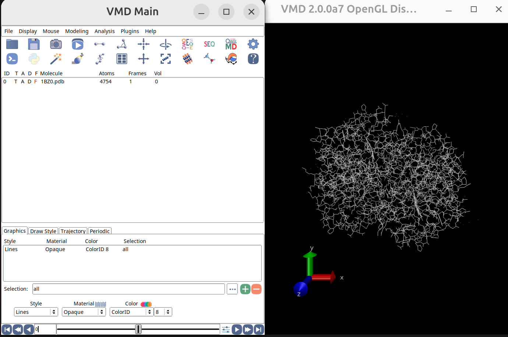
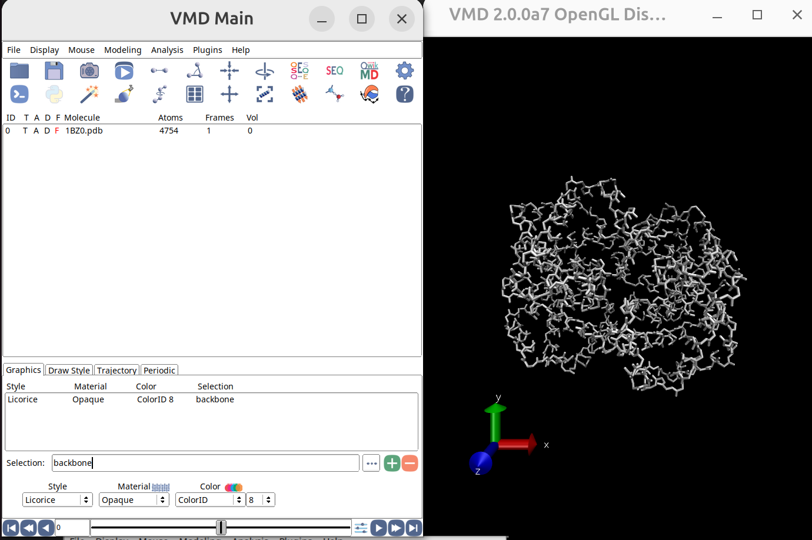
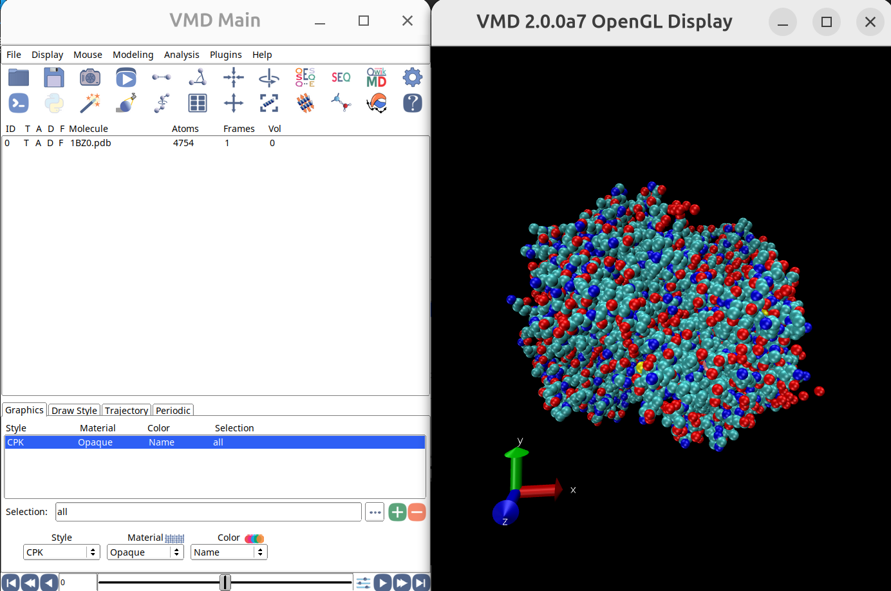
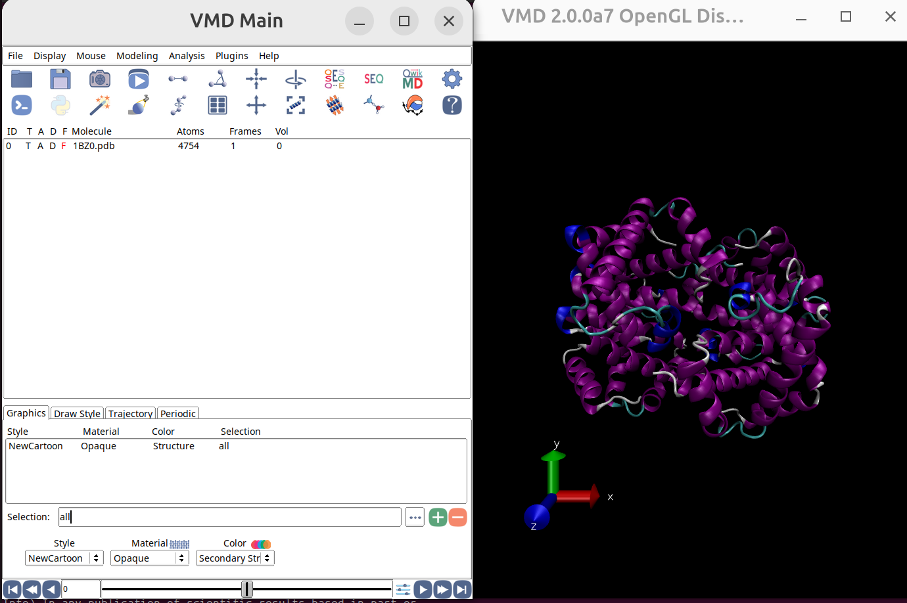
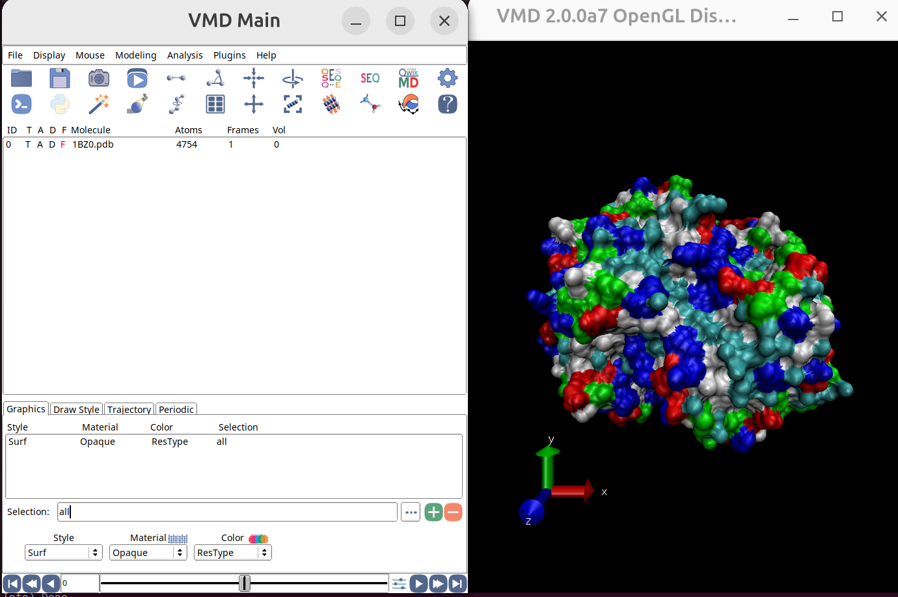
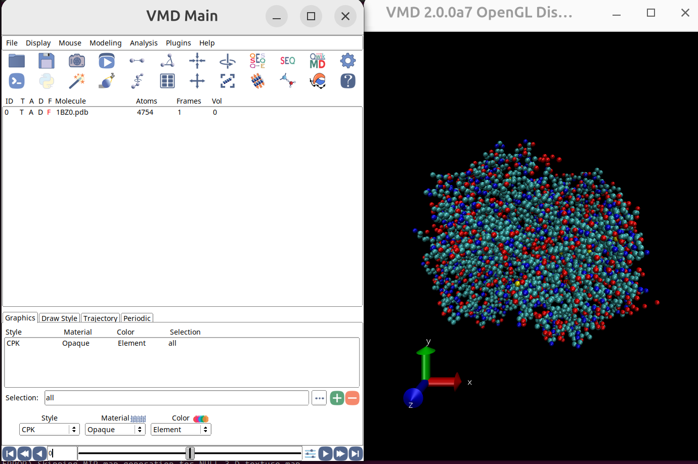
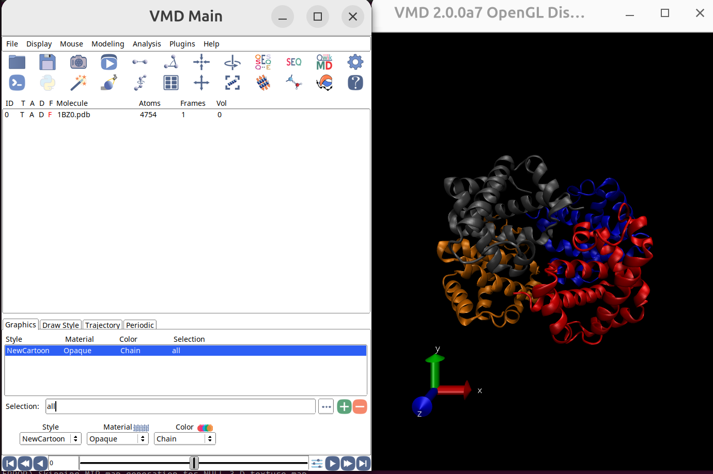
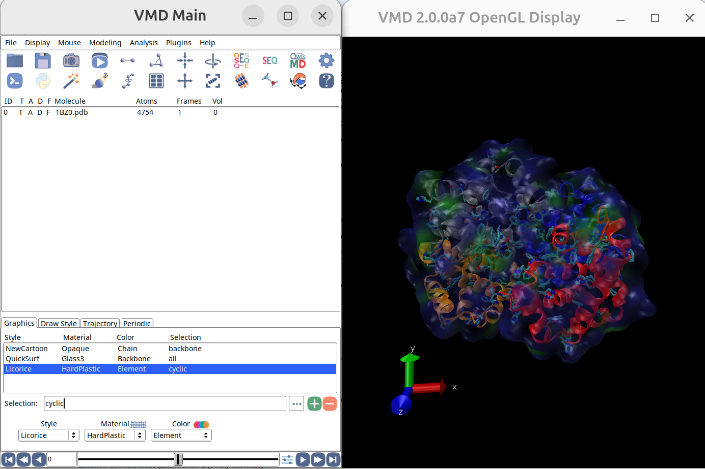
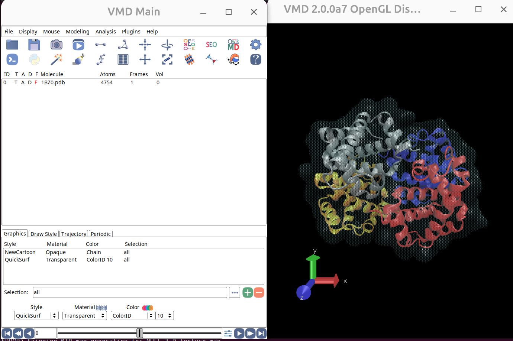

# Домашнее задание 5. 
## Визуализация структуры белка

### 1. ПО и структура белка
ПО: [VMD](http://www.ks.uiuc.edu/Research/vmd/)

Структура: [1BZ0](https://www.rcsb.org/structure/1BZ0)

### 2. Полученные изображения белка

#### a. Wireframe

#### b. Backbone 

#### c. Spacefill 

#### d. Ribbons
Лучший способ показать вторичную структуру (α-спирали, β-листы)

#### e. Molecular surface

### Визуализация по цветам
#### a. CPK

#### a. Domain
1BZ0 содержит 4 глобиновых домена:
2 альфа-цепи (α1, α2)
2 бета-цепи (β1, β2)

Поэтому можно разделить на домены по цепям.

### 3. Описание способа получения визуализации в выбранном ПО
File -> New Molecule -> Browse -> Load -> Graphics -> Draw Style

### 4. Ваше изображение белка публикационного качества
Игрался с цветами и стилями, вышло 2 красивые картинки:

