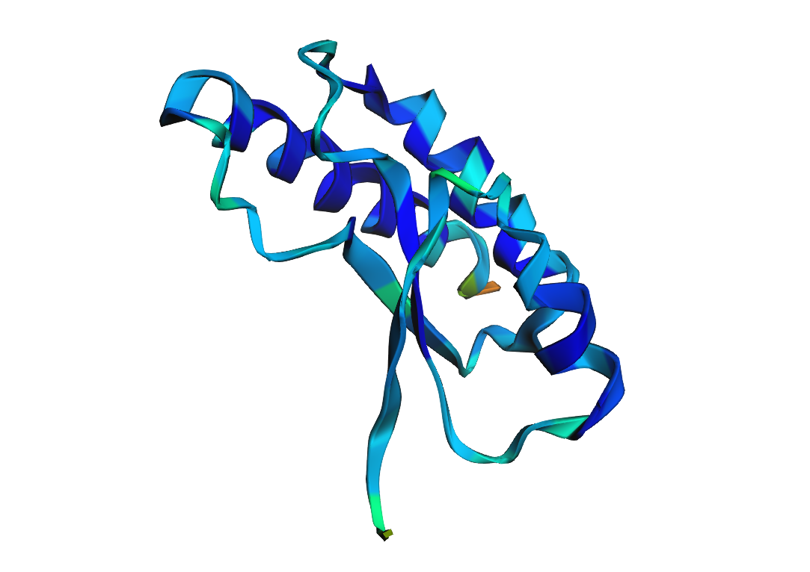
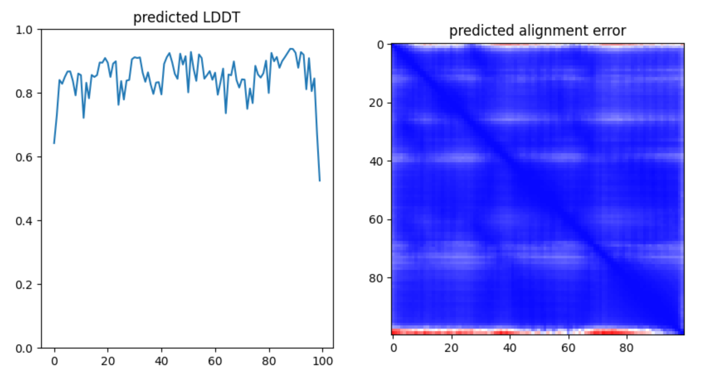
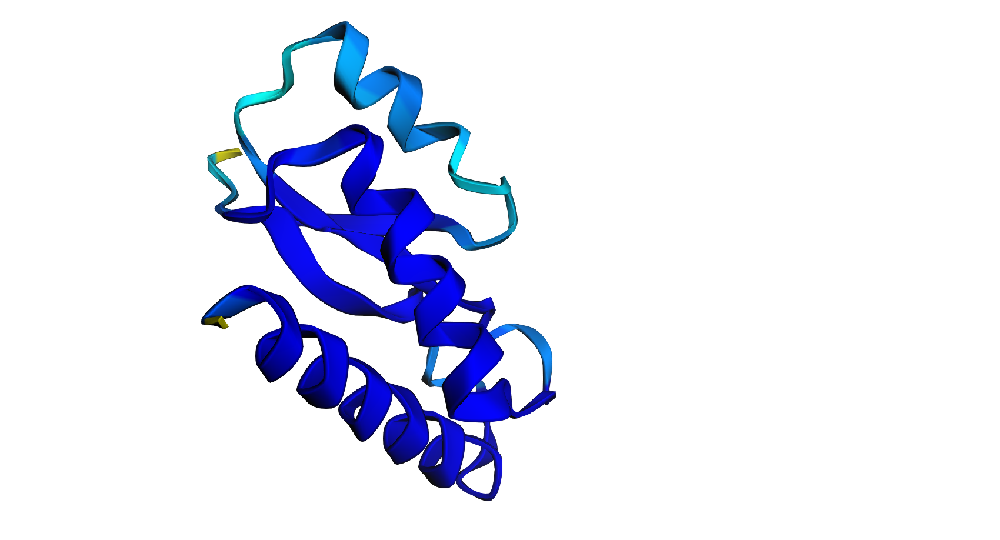
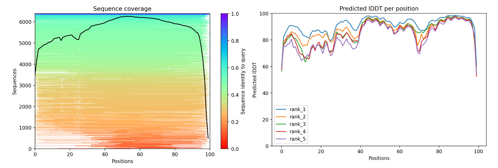
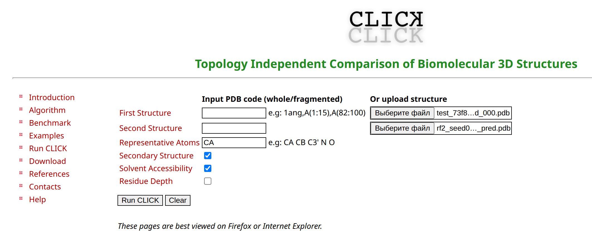
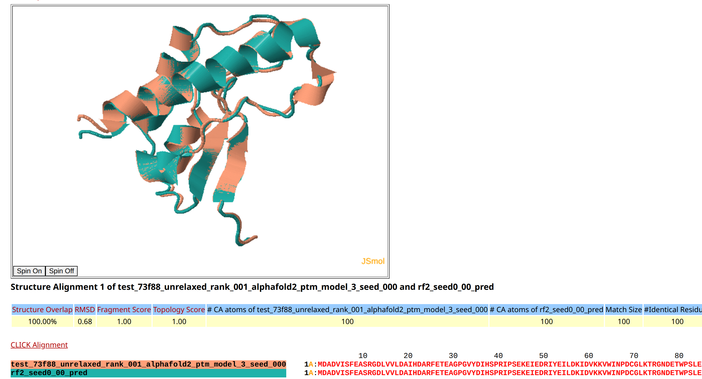
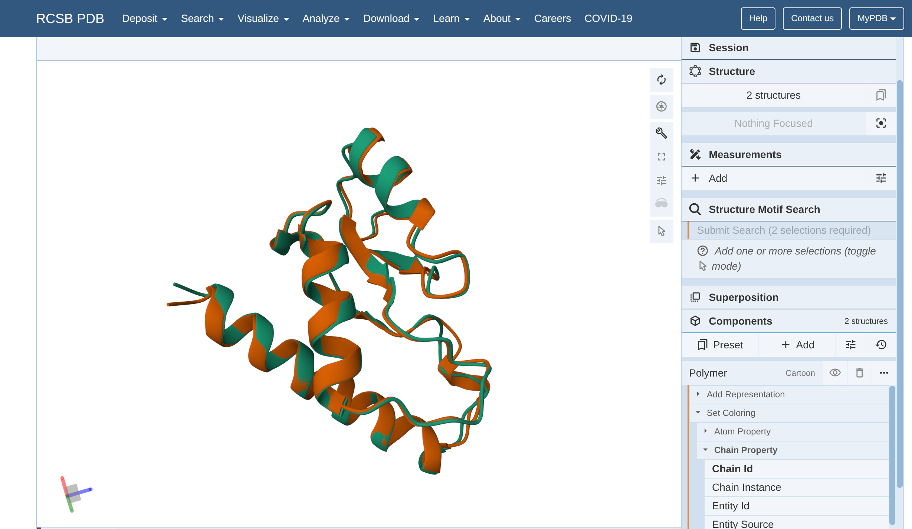

# Домашнее задание 5. Предсказание и парное выравнивание структур белков

## 1. Инструменты

Инструмент 1 для фолдинга: [**RoseTTAFold2**](https://colab.research.google.com/github/sokrypton/ColabFold/blob/main/RoseTTAFold2.ipynb)  

Инструмент 2 для фолдинга: [**AlphaFold2**](https://colab.research.google.com/github/sokrypton/ColabFold/blob/main/AlphaFold2.ipynb)

Моя последовательность: MDADVISFEASRGDLVVLDAIHDARFETEAGPGVYDIHSPRIPSEKEIEDRIYEILDKIDVKKVWINPDCGLKTRGNDETWPSLEHLVAAAKAVRARLDK

Инструмент парного выравнения: [**CLICK**](https://mspc.bii.a-star.edu.sg/minhn/pairwise.html)

## 2. Работа в Google Collab

Сделал копии ноутбуков в Google Collab

[**RoseTTAFold2**](https://colab.research.google.com/drive/10Mx4hLtAMvnryhI_NZMw9G3EMKZmfBr1?usp=sharing)
[**AlphaFold2**](https://colab.research.google.com/drive/1InB1XIz55KHuf0JslzwvOeNn7d9Ak2TW?usp=sharing)

## 3. Предсказания

Результаты прогонов для каждого из этих инструментов находят в соответствующих папках.

Фотографии RoseTTAFold2:

Фотографии AlphaFold2:

## 4. Инструмент парного выравнивания

Загрузил оба результата в формате pdb

Воспользовался [**CLICK**](https://mspc.bii.a-star.edu.sg/minhn/pairwise.html) инструментом парного выравнивания.

## 5 и 6. Визуализация

Фотография:

И еще раз нарисовал это в [**RCSB**](https://www.rcsb.org/3d-view/)
Раскраска идет по различным цепям

## 7. Выводы

Выводы по результатам выравнивания структур

**1) RMSD (Root Mean Square Deviation):**

- Значение RMSD составляет 0.68.

- Это указывает на небольшие отличия между моделями, так как оно меньше 1.

**2) Structure Overlap:**

- Значение 100% - выровнены все 100 остатков из 100 возможных

**3) Топологические показатели:**

- Fragment Score = 1.00 - идеальное совпадение фрагментов

- Topology Score = 1.00 - идентичная топология (порядок и расположение структурных элементов)

### Итог
Поскольку одна структура от AlphaFold2, а другая от RoseTTAFold2, этот результат демонстрирует:

- Высокую точность предсказания обоих методов

- Их согласованность друг с другом для данного белка