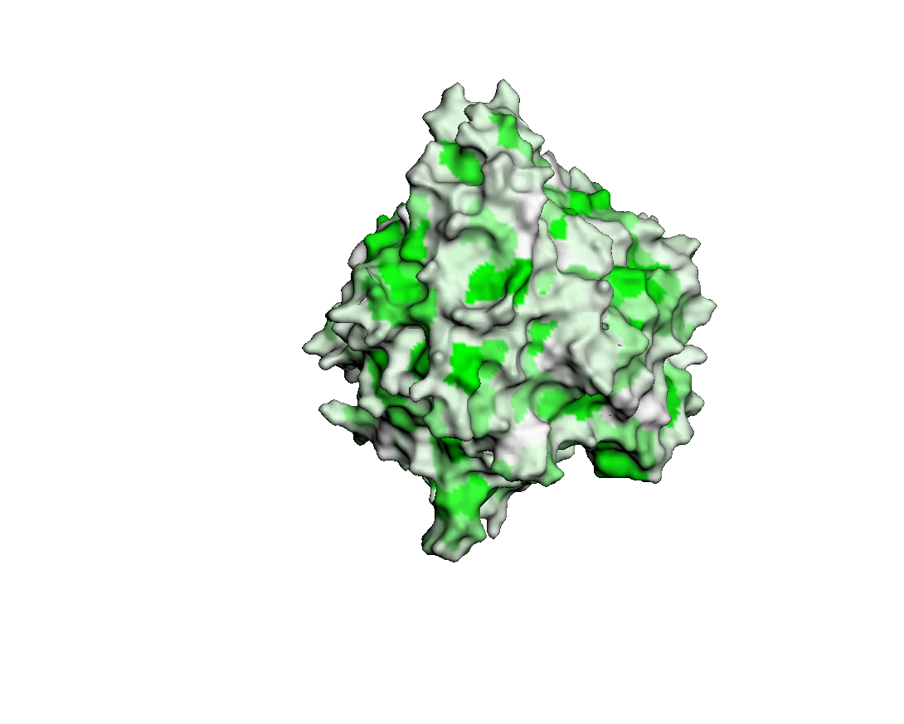
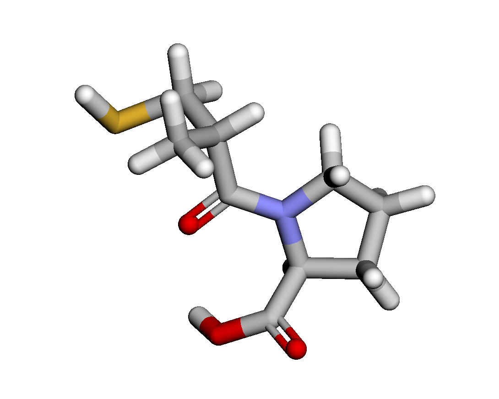
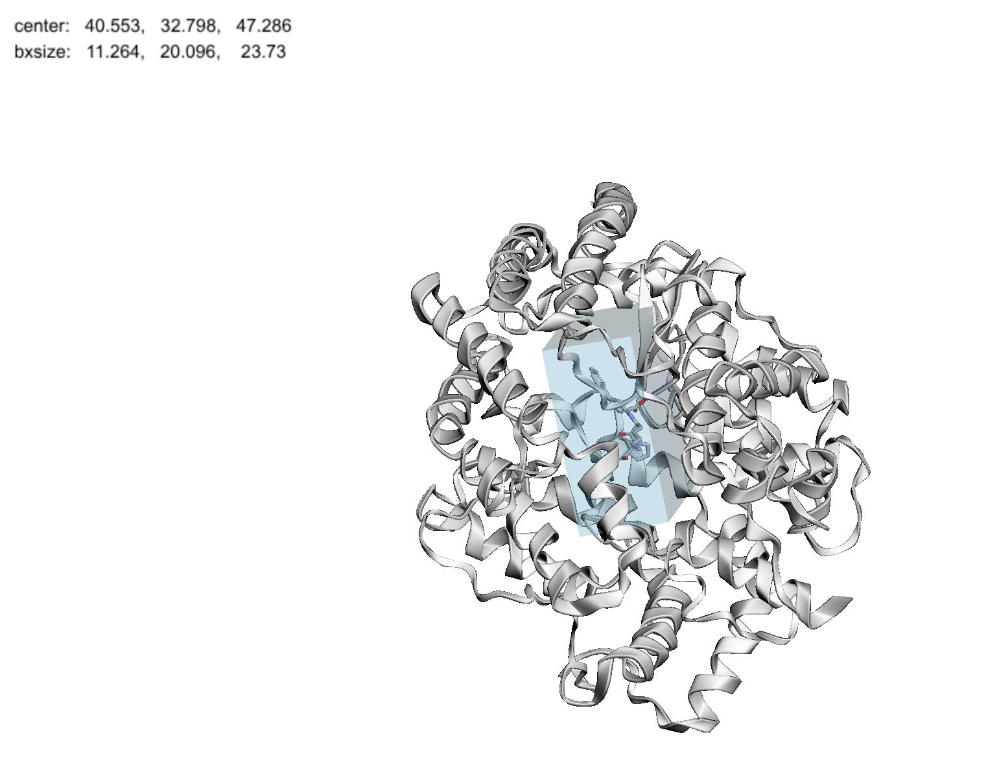
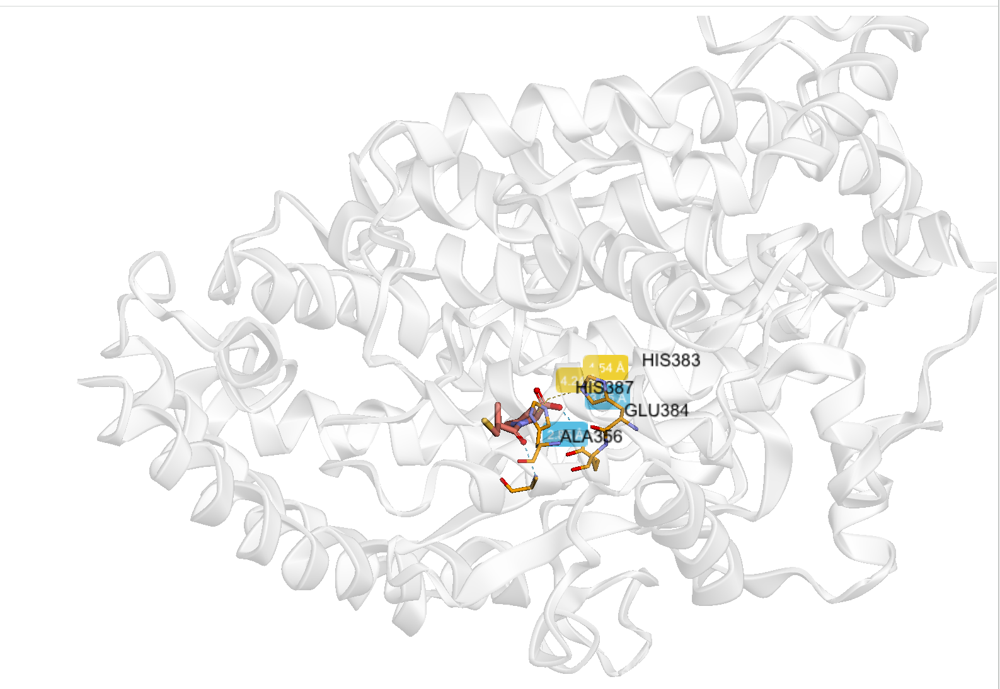

# Домашнее задание 6. Докинг лекарственных молекул

## 1. Общая информация о препарате

**Коммерческое наименование:** Каптоприл

a. **Действующее вещество**: Каптоприл (Captopril).

b. **Область применения:** Каптоприл применяется для лечения:

- Артериальной гипертензии (повышенного артериального давления).

- Сердечной недостаточности.

- Диабетической нефропатии (особенно при сахарном диабете 1 типа).

- Состояния после инфаркта миокарда для улучшения функций сердца.

c. **Молекулярный механизм действия:** Каптоприл является ингибитором ангиотензин-превращающего фермента (АПФ).

Он блокирует фермент, преобразующий ангиотензин I в ангиотензин II — вещество, которое вызывает сужение кровеносных сосудов и повышает артериальное давление. Путем ингибирования образования ангиотензина II, каптоприл:

1. Снижает тонус сосудов.
2. Уменьшает общее периферическое сосудистое сопротивление.
3. Уменьшает задержку натрия и воды в организме, что также снижает давление.

Эти эффекты помогают снизить артериальное давление и уменьшить нагрузку на сердце.

**Немного терминологии:**

- Ангиотензинпревращающий фермент (ACE) — это фермент, который играет ключевую роль в регуляции кровяного давления и баланса жидкости в организме.
  Он принадлежит к группе металлопротеиназ и встречается на поверхности клеток, в основном в легких, почках и сосудах.

## 2. Работа с GoogleColab

1. PDB ID представляет структуру мишени — Angiotensin-Converting Enzyme (ACE).

Во всех блоках кода, где требуется указать мишень, используем 1O86.

2. В 4 пункте вставляем SMILES

SMILES для каптоприла: C[C@H](CS)C(=O)N1CCC[C@H]1C(O)=O

3. Укажем keyword: LPR

Keyword — это идентификатор для маркировки выходных данных, чтобы связать их с вашим экспериментом.

4. Сохранение результатов

Все результаты сохранены в папку Captopril_1O86.

Использованный блокнот с доработками - Task6.ipynv

## 3. Полученные результаты докинга
Все результаты сохранены в папку Captopril_1O86/DOCKING/SIM.

## 4. Изображения

1. Трёхмерная структура

2. Трехмерная структура исходного лиганда

3. Полученный бокс

4. Полученный докинг

